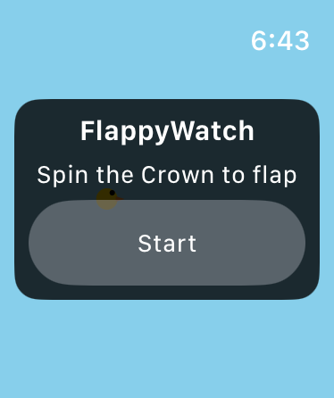

# FlappyWatch

[](LICENSE)

watchOS prototype: Flappy Bird, but the only input is the Digital Crown -- no tap, no button.



Created by oyoroi.com as a tech experiment for Apple Watch games using the digital crown.

Built with SwiftUI (`Canvas` + `TimelineView`, no SpriteKit) as a standalone watch app.

## Crown mapping

Crown rotation is read as a flap gesture, not a position or a rate-of-turn steering angle.
Spin in either direction and the rotation *magnitude* accumulates; every time it crosses a
fixed threshold the bird flaps once. Gravity pulls the bird down continuously, same as the
original game. Spin faster and you flap more often, same relationship as tapping faster in
the original -- it's meant to feel like winding a reel, not like steering.

## Status: tested successfully on device

Builds and runs on both the Simulator and a physical Apple Watch -- gravity, floor/ceiling
death, pipe spawning/scrolling/scoring, the ready/game-over overlays, and the Digital Crown
flap mechanic have all been verified. `flapSpinThreshold`, `flapImpulse`, and `gravity` in
`GameEngine.swift` are the tuning knobs if the cadence feels off.

## Project layout

```
project.yml                     XcodeGen spec (source of truth for the .xcodeproj)
FlappyWatch Watch App/
  FlappyWatchApp.swift           App entry point
  Views/ContentView.swift        Canvas rendering, HUD, Digital Crown input, overlays
  Game/
    GameEngine.swift             Game state machine and physics loop
    Pipe.swift                   Value type used by the engine
  Assets.xcassets/                Accent color; AppIcon is an empty placeholder (no real icon yet)
```

`FlappyWatch.xcodeproj` is generated by [XcodeGen](https://github.com/yonaskolb/XcodeGen) from
`project.yml`. Don't hand-edit the `.xcodeproj` -- edit `project.yml` and regenerate.

No iOS container target -- this is a feel-test prototype, not set up for App Store distribution.

## Building

```sh
brew install xcodegen   # if not already installed
xcodegen generate
```

Then either open `FlappyWatch.xcodeproj` in Xcode and run on a watchOS Simulator or device, or build
from the command line:

```sh
xcodebuild -project FlappyWatch.xcodeproj -scheme "FlappyWatch Watch App" \
  -destination 'platform=watchOS Simulator,name=Apple Watch Series 11 (42mm)' build
```

Requires watchOS 10+ (deployment target) and Xcode with a matching watchOS Simulator runtime installed.
